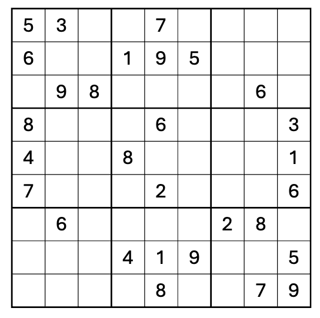

# **Lab 2: Sudoku and N-Queens Solver Using Backtracking**

## **1. Sudoku**

In this lab, you will implement a **Sudoku solver and N-Queens using backtracking**.



Sudoku is a logic puzzle played on a **9 × 9 grid**. Some cells are already filled with numbers, while the remaining cells are empty. Your goal is to fill all empty cells so that the completed board satisfies the Sudoku rules. A completed Sudoku board must satisfy all three rules:

1. Each **row** contains the numbers `1–9` exactly once.
2. Each **column** contains the numbers `1–9` exactly once.
3. Each **3 × 3 subgrid** contains the numbers `1–9` exactly once.

This lab will help you practice:

- Recursion
- Backtracking
- Exploring possible choices
- Checking whether a choice is valid
- Undoing a choice when it leads to a dead end

In this lab, an empty cell in a Sudoku grid is represented by `0`.

## **Backtracking**

Your solver should use **backtracking** to search for a solution.

The general idea is:

```text
1. Find an empty cell.
2. Try a possible number.
3. Check whether the number is valid.
4. If valid:
      Place the number.
      Recursively solve the rest of the board.
5. If the recursive call fails:
      Undo the choice.
      Try another number.
6. If no number works:
      Backtrack to the previous decision.
```

Think about the backtracking process as:

**Choose → Explore → Undo**

Please follow the slides and the general backtracking code template and **implement it yourself**. 


## **Submission Requirements**

Submit your completed Python file.

Your submission should:

- Correctly solve the provided Sudoku puzzle.
- Use recursion and backtracking.
- Correctly check row, column, and 3 × 3 subgrid constraints.
- Include comments explaining the important parts of your implementation. **Failure to include sufficient comments will result in a 10-point deduction.**
- Produce readable output showing the original and solved Sudoku boards.
- Submit your code as **lab_{your_name}.py**

Make sure your program runs successfully before submitting it.


## **Part 1: Find an Empty Cell** (10 pts)

Complete the function:

```python
def find_empty(board):
```

Search the board for an empty cell (`0`).

If an empty cell is found, return its position:

```python
(row, col)
```

If there are no empty cells, return:

```python
None
```

For example, if the first empty cell is at row `0`, column `2`:

```python
find_empty(board)
```

should return:

```python
(0, 2)
```

**Think about why we need this function. What is the base case for this problem?**


## **Part 2: Check Whether a Choice Is Valid** (25 pts)

Complete the function:

```python
def is_legal(board, row, col, num):
```

This function determines whether `num` can legally be placed at `board[row][col]`.

You must check all three Sudoku constraints:

### **Row**

`num` must not already appear in the same row.

### **Column**

`num` must not already appear in the same column.

### **3 × 3 Subgrid**

`num` must not already appear in the same 3 × 3 subgrid.

The function should return:

```python
True
```

if the placement is valid, and:

```python
False
```

otherwise.

### **Hint**

For a cell located at `(row, col)`, think about how you can determine the starting row and column of its 3 × 3 subgrid using integer division (`//`).


## **Part 3: Solve the Sudoku Using Backtracking** (25 pts)

Complete:

```python
def solve_sudoku(board):
```

Your function must use **recursion and backtracking** and should return:

```python
True
```

when the Sudoku has been successfully solved.

If the current branch cannot produce a valid solution, return:

```python
False
```

### **Important**

Your implementation must actually use **backtracking**.

Do not use:

- An external Sudoku-solving library
- A pre-built solver
- Brute-force generation of all possible completed boards


## **Part 4: Test Your Solver** 

### Part 4.1 (10 pts): Use the following puzzle to test your implementation:

```python
board_1 = [
    [5, 3, 0, 0, 7, 0, 0, 0, 0],
    [6, 0, 0, 1, 9, 5, 0, 0, 0],
    [0, 9, 8, 0, 0, 0, 0, 6, 0],
    [8, 0, 0, 0, 6, 0, 0, 0, 3],
    [4, 0, 0, 8, 0, 3, 0, 0, 1],
    [7, 0, 0, 0, 2, 0, 0, 0, 6],
    [0, 6, 0, 0, 0, 0, 2, 8, 0],
    [0, 0, 0, 4, 1, 9, 0, 0, 5],
    [0, 0, 0, 0, 8, 0, 0, 7, 9]
]
```

Your program should display the board **before** solving it and **after** solving it.


### Part 4.2 (30 pts)

A partially filled Sudoku board can have:

- **No solution** — the clues are inconsistent.
- **Exactly one solution** — this is what a well-designed standard Sudoku puzzle is supposed to have.
- **Multiple solutions** — there aren’t enough constraints/clues to force a unique answer.

For example, an almost empty board can have an enormous number of valid completions.


**Use the following two boards: how many solutions can you find? Modify your code to print out all the answers** 

```python
board_2 = [
    [5, 3, 0, 0, 7, 0, 0, 0, 0],
    [6, 0, 0, 1, 9, 5, 0, 0, 0],
    [0, 9, 8, 0, 0, 0, 0, 6, 0],
    [8, 0, 0, 0, 6, 0, 0, 0, 3],
    [4, 0, 0, 8, 0, 3, 0, 0, 1],
    [7, 0, 0, 0, 2, 0, 0, 0, 6],
    [0, 6, 0, 0, 0, 0, 2, 0, 0],  
    [0, 0, 0, 4, 1, 9, 0, 0, 5],
    [0, 0, 0, 0, 8, 0, 0, 7, 9]
]
```

```python
board_3 = [
    [5, 3, 0, 0, 7, 0, 0, 0, 0],
    [6, 0, 0, 1, 9, 5, 0, 0, 0],
    [0, 9, 0, 0, 0, 0, 0, 6, 0],
    [8, 0, 0, 0, 6, 0, 0, 0, 3],
    [4, 0, 0, 8, 0, 3, 0, 0, 1],
    [7, 0, 0, 0, 2, 0, 0, 0, 6],
    [0, 6, 0, 0, 0, 0, 2, 8, 0],
    [0, 0, 0, 4, 1, 9, 0, 0, 5],
    [0, 0, 0, 0, 8, 0, 0, 7, 9]
]
```

```python
board_4 = [
    [5, 1, 0, 0, 7, 0, 0, 0, 0],
    [6, 0, 0, 1, 9, 5, 0, 0, 0],
    [0, 9, 8, 0, 0, 0, 0, 6, 0],
    [8, 0, 0, 0, 6, 0, 0, 0, 3],
    [4, 0, 0, 8, 0, 3, 0, 0, 1],
    [7, 0, 0, 0, 2, 0, 0, 0, 6],
    [0, 6, 0, 0, 0, 0, 2, 8, 0],
    [0, 0, 0, 4, 1, 9, 0, 0, 5],
    [0, 0, 0, 0, 8, 0, 0, 7, 9]
]
```

- **You should print out all solutions and the total number of solutions.**
- **If there is no solution, print out "No solution found."**


## Extra Credit (10 pts): Diagonal Sudoku 

For extra credit, extend your Sudoku solver to support **Diagonal Sudoku**.

A Diagonal Sudoku follows all the standard Sudoku rules:

1. Each row must contain the numbers `1–9` exactly once.
2. Each column must contain the numbers `1–9` exactly once.
3. Each `3 × 3` subgrid must contain the numbers `1–9` exactly once.

In addition, a Diagonal Sudoku has **two additional constraints**:

4. The **main diagonal** (top-left to bottom-right) must contain the numbers `1–9` exactly once.
5. The **anti-diagonal** (top-right to bottom-left) must contain the numbers `1–9` exactly once.

**Use the following example to test your implementation:**

```python
board_5 = [
    [0, 0, 0, 0, 0, 0, 0, 5, 0],
    [0, 0, 0, 0, 0, 0, 4, 0, 0],
    [5, 3, 0, 7, 0, 0, 0, 8, 0],
    [0, 0, 1, 6, 3, 0, 0, 0, 0],
    [0, 0, 0, 0, 0, 8, 9, 6, 0],
    [0, 0, 0, 0, 0, 0, 0, 0, 0],
    [0, 0, 0, 0, 0, 6, 0, 0, 0],
    [3, 0, 7, 0, 0, 0, 0, 9, 0],
    [1, 0, 0, 0, 7, 9, 0, 2, 0]
]
```

**Print out the answer and check if it is what is expected.**

### Requirements

Modify your existing Sudoku solver so that it also checks the two diagonal constraints.

Your program should:

- Continue to use **backtracking**.
- Check the main diagonal when the current cell belongs to the main diagonal.
- Check the anti-diagonal when the current cell belongs to the anti-diagonal.
- Find and print all valid solutions to the provided Diagonal Sudoku puzzle.
- Include comments explaining your additional diagonal constraint checks.

### Hint

Think about the relationship between `row` and `col`.

For a cell on the **main diagonal**, what relationship exists between its row and column?

For a cell on the **anti-diagonal**, what relationship exists between its row and column?

Do not hard-code the individual diagonal cell positions.