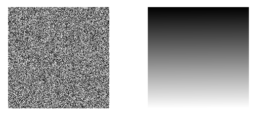
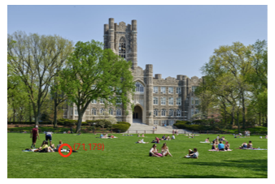

# Lab 3: Sorting and Selection with Images
## Overview

In this lab, you will apply **MergeSort, QuickSort, and QuickSelect** to image data. Instead of sorting a small list of numbers, you will work with the numerical values that make up real images.

You will work on two parts:

1. **Sort the pixels of a grayscale image**

   

   1. Implement MergeSort.
   2. Implement QuickSort.
   3. Sort the pixel intensities in ascending and descending order.
   4. Reconstruct and save the sorted pixels as images. The result should form a smooth grayscale gradient.

2. **Find a brightest pixel in a color image**

   

   1. Convert each RGB pixel into a single brightness value.
   2. Implement QuickSelect.
   3. Use QuickSelect to find the maximum brightness value without fully sorting the image.
   4. Locate one pixel with that brightness and mark it on the original image.


The starter file handles image loading, conversion, reshaping, displaying, and saving. **You only need to implement the sorting/selection algorithms in the TODO sections.**


## Submission Requirements

- Submit your code as `lab3_{your_name}.py`.

- For the required algorithm implementations, **do not use built-in sorting or selection functions** such as:

  ```python
  sorted()
  list.sort()
  np.sort()
  np.partition()
  ```

  The purpose of the lab is to implement MergeSort, QuickSort, and QuickSelect yourself.

- Add comments explaining the important parts of your implementation.

- Before submitting, run the entire program from beginning to end and make sure there are no errors.


## 1. How is an image represented by a computer?

A digital image is made of many small elements called **pixels**. A computer represents these pixels using numbers.

### Grayscale images

A grayscale image can be represented as a 2-D matrix:

```text
[[0, 25, 100, 255],
 [40,80, 120, 200],
 [10,50, 150, 230]]
```

Each number represents the intensity of one pixel:

- `0` = black
- `255` = white
- values between 0 and 255 = different shades of gray

Therefore, an image with height `H` and width `W` can be represented by an `H x W` matrix.

To use our sorting algorithms, we will **flatten** this matrix into a one-dimensional list:

```text
2-D image:
[[30, 10],
 [50, 20]]

  ↓ flatten

1-D:
[30, 10, 50, 20]
```

After sorting the list, we reshape it back into the original height and width so that it can be viewed as an image again.

### Color images

A normal RGB color image has **three channels**:

- **R** = Red
- **G** = Green
- **B** = Blue

One pixel is therefore represented by three numbers. For example:

```text
[255,   0,   0]  -> red
[  0, 255,   0]  -> green
[  0,   0, 255]  -> blue
[255, 255, 255]  -> white
```

A color image is therefore an `H x W x 3` array.

For the QuickSelect task, we need one number for each pixel. We will convert `(R, G, B)` into a single perceived brightness value:

```text
Y = 0.299R + 0.587G + 0.114B
```

The starter code already performs this conversion for you.

---

## 2. Setup

You will need three Python libraries:

- **NumPy** - represents and reshapes image data as arrays.
- **Pillow (PIL)** - loads, creates, draws on, and saves images.
- **Matplotlib** - displays images and results.

### Install the libraries

Open Terminal (macOS/Linux) or Command Prompt/PowerShell (Windows) and run:

```bash
pip install numpy pillow matplotlib
```

If `pip` does not work, try:

```bash
python -m pip install numpy pillow matplotlib
```

or, on some computers:

```bash
python3 -m pip install numpy pillow matplotlib
```

If you are using Jupyter Notebook, you can also run:

```python
!pip install numpy pillow matplotlib
```

To check that installation was successful:

```python
import numpy
import PIL
import matplotlib

print("Libraries imported successfully!")
```

**If you cannot install these libraries successfully, please reach out as soon as possible. Do not wait until the lab is due.**

---

## 3. Files

Keep these files in the same folder:

```text
Lab3/
├── lab3.py
├── gray_image.png
└── fordham.png
```

If you are using Google Colab, upload the two image files to Colab before running the program.

---

## 4. Part I - Sorting a Grayscale Image

Load `gray_image.png`.

The starter code will:

```text
image file
    ↓
Pillow image
    ↓
NumPy 2-D array
    ↓
flatten()
    ↓
1-D Python list
    ↓
YOUR SORTING ALGORITHM
    ↓
reshape()
    ↓
new image
```

###  4.1: MergeSort

Complete:

```python
def merge_sort(arr, ascend=True):
```

and its helper:

```python
def merge(left, right, ascend=True):
```

Your implementation must support:

```python
ascend=True
```

and

```python
ascend=False
```

The program will save:

```text
MergeSort_ascending_sorted_gray.png
MergeSort_descending_sorted_gray.png
```

### 4.2: QuickSort

Complete:

```python
def quick_sort(arr, low, high, ascend=True):
```

and:

```python
def partition(arr, low, high, ascend=True):
```

QuickSort should modify the list **in place**.

The program will save:

```text
QuickSort_ascending_sorted_gray.png
QuickSort_descending_sorted_gray.png
```


## 5. Part II - Finding a Brightest Pixel with QuickSelect

For the second task, load `fordham.png`.

Each pixel originally contains:

```text
[R, G, B]
```

The starter code converts each pixel to:

```text
brightness = 0.299R + 0.587G + 0.114B
```

It then flattens the 2-D brightness matrix into a one-dimensional Python list.

### QuickSelect

Complete:

```python
def quick_select(arr, k):
```

You may reuse your QuickSort `partition()` function.

Remember that if an ascending array has `n` elements:

```text
smallest element  -> index 0
largest element   -> index n - 1
```

Therefore, to find the maximum:

```python
k = len(arr) - 1
```

Unlike QuickSort, **QuickSelect does not need to completely sort the list**. After partitioning, continue only on the side that can contain index `k`.

The starter code will then:

1. Find the coordinates of one pixel having that brightness.
2. Draw a red circle around it.
3. Label its `(x, y)` coordinates.
4. Save:

```text
fordham_marked.png
```


